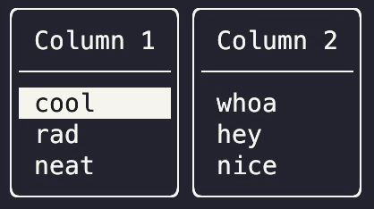
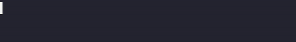
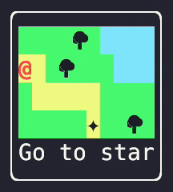

# Gren TUI

Write purely functional, type-safe terminal apps using [The Elm Architecture](https://guide.elm-lang.org/architecture/).
Easily create complex, responsive UIs with an interface inspired by [elm-ui](https://package.elm-lang.org/packages/mdgriffith/elm-ui/latest/).
All in the very pleasant [Gren programming language](https://gren-lang.org/).

## Examples



[source](examples/v3/highlight-selection/src/Main.gren)

---



[source](examples/v3/progress-bar/src/Main.gren)

---



[source](examples/v3/game/src/Main.gren)

---

You can find [all the example apps here](https://github.com/blaix/gren-tui/blob/main/examples/v3).

## Usage

If you haven't already, [install node](https://nodejs.org/en), [install gren](https://gren-lang.org/install),
and take a look at [the book](https://gren-lang.org/book/) if you want to get up to speed with the language.

Then create a gren node application:

```
mkdir myapp
cd myapp
gren init --platform=node
```

Install the `gren-tui` package:

```
gren package install blaix/gren-tui
```

Then create a `src/Main.gren` file. For a starting point, see:

* The example above.
* The [examples/](https://github.com/blaix/gren-tui/tree/main/examples) directory.

Then compile and run with:

```
gren make src/Main.gren
node app
```

## Now what?

Check out the [API docs](https://packages.gren-lang.org/package/blaix/gren-tui) and start writing your app!

Feel free to reach out if you need help, or to show off what you're building.
I'd love to see it!
See below for contact info.

## Getting Help or Updates

If you have questions, suggestions, find a bug, or want to follow updates to the package, you can:

* Follow me on mastodon at [@blaix@hachyderm.io](https://hachyderm.io/@blaix).
* Join the [`#gren-tui`](https://discord.gg/etMAVy2YKf) channel on the gren discord.
* File an [issue](https://github.com/blaix/gren-tui/issues) on github.
